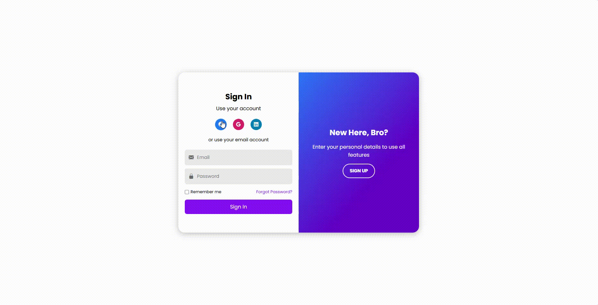

# 🔐 Sliding Sign In / Sign Up Authentication UI

A sleek, responsive, and accessible **Sliding Sign In / Sign Up interface** built with **HTML** and **CSS** — enhanced by **Bootstrap Icons** and **Google Fonts**.  
Designed by **Stephen William G. De Jesus**, this project features a smooth sliding panel effect for switching between login and registration views, with clean form design and mobile responsiveness.

---

## 📸 Preview  


---

## 🌐 Live Demo  
[View Live Demo](https://bogiiiie.github.io/03-html-css-sliding-login-signup-form/)

---

## 📁 Features

✅ Sliding panel animation to switch between Sign In and Sign Up  
✅ Social login buttons with branded colors and icons  
✅ ARIA-compliant structure for accessibility  
✅ Responsive design with media queries for mobile and desktop  
✅ Modern UI using the Poppins font  
✅ Bootstrap Icons integration for inputs and actions  
✅ Custom checkbox styles for "Remember Me" and "Terms" agreement  
✅ Visual focus indicators and placeholder enhancements  

---

## 🛠️ Built With

- **HTML5** – semantic and accessible markup  
- **CSS3** – transitions, layout, and responsive styling  
- **Google Fonts** – [Poppins](https://fonts.google.com/specimen/Poppins) for typography  
- **Bootstrap Icons** – for social and form icons  

---

## 🚀 Getting Started

To run this project locally:

1. Clone the repo:
   ```bash
   git clone https://github.com/bogiiiie/03-html-css-sliding-login-signup-form.git
